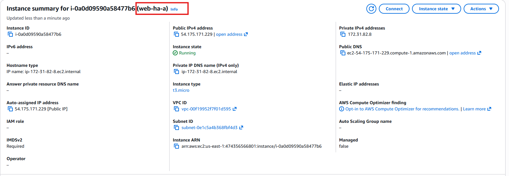
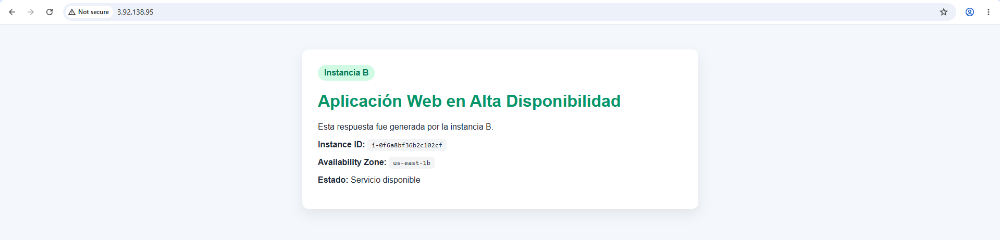
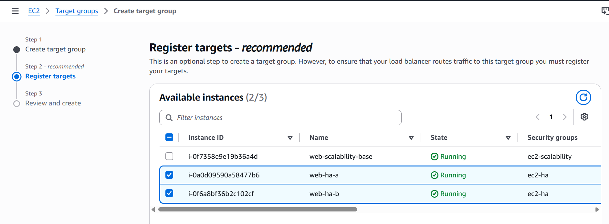
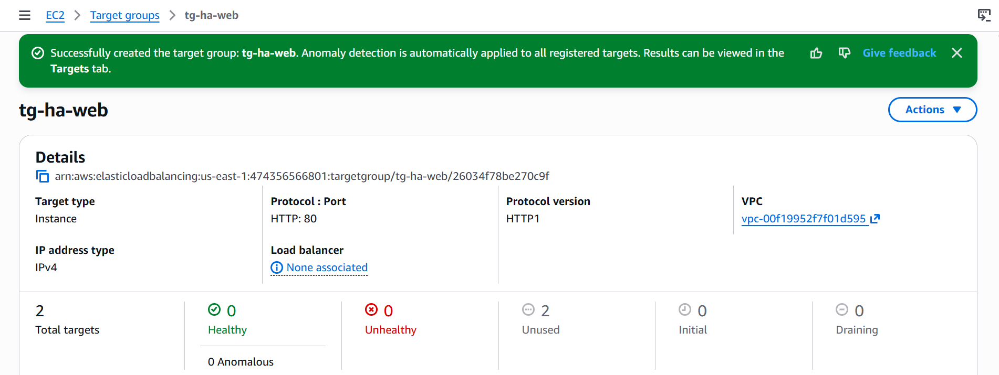
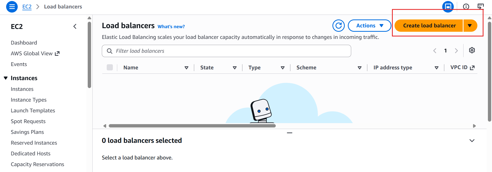
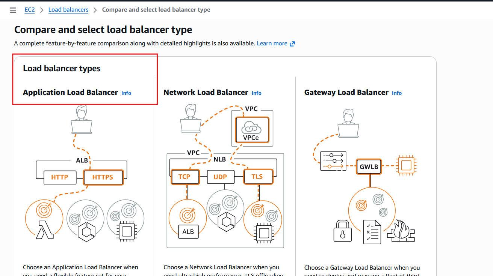
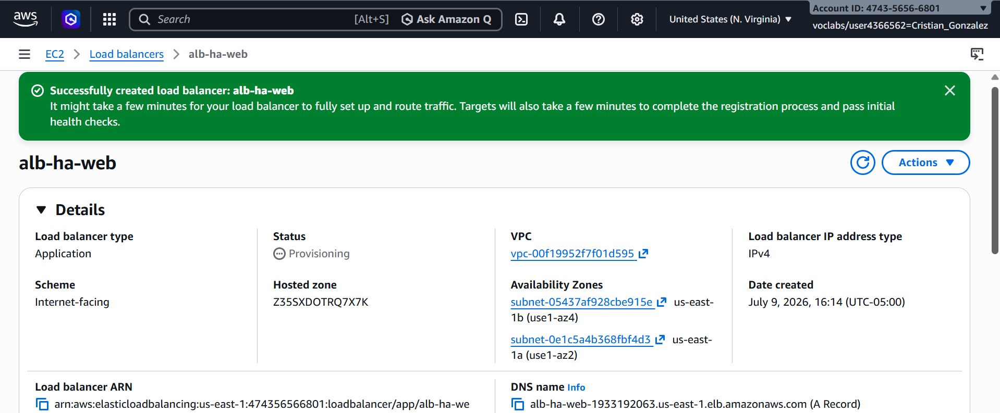
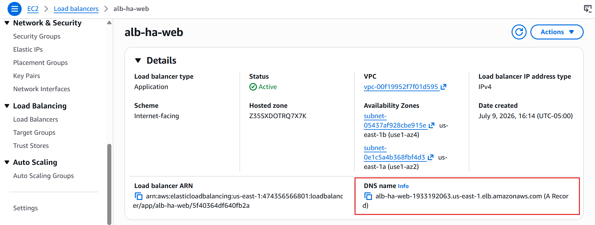
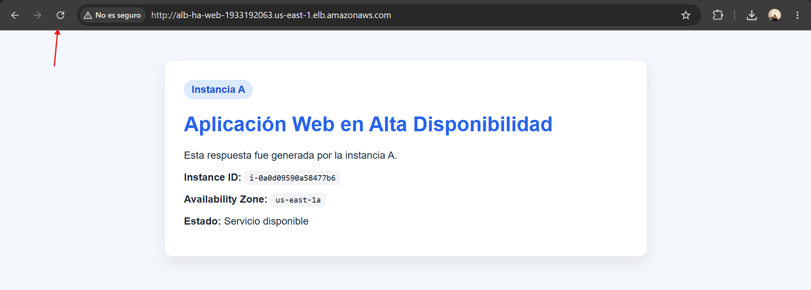
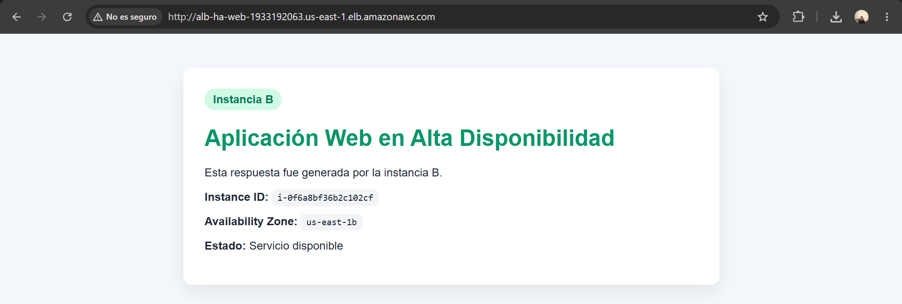

# Guía de Laboratorio: Alta Disponibilidad con Application Load Balancer en AWS

## Información General

| Campo | Detalle |
|:---|:---|
| **Asignatura** | Arquitecturas de Software |
| **Plataforma** | AWS Academy Learner Lab |
| **Créditos disponibles** | 50 USD |

---

## 1. Propósito del Laboratorio

En los sistemas modernos no basta con desplegar una aplicación en un único servidor. Si ese servidor falla, el sistema completo queda fuera de servicio. La alta disponibilidad busca reducir ese riesgo mediante redundancia, balanceo de carga, detección de fallos y distribución de componentes en varias zonas de disponibilidad.

En este laboratorio, el estudiante implementará una arquitectura básica de alta disponibilidad en AWS utilizando:

- Amazon EC2
- Application Load Balancer
- Target Group
- Security Groups
- Health Checks
- Dos zonas de disponibilidad

---

## 2. Resultados de Aprendizaje

Al finalizar el laboratorio, el estudiante estará en capacidad de:

- Explicar qué es alta disponibilidad
- Diferenciar disponibilidad, tolerancia a fallos y escalabilidad
- Crear una arquitectura redundante con dos instancias EC2
- Configurar un Application Load Balancer
- Crear un Target Group con health checks
- Validar el balanceo de carga entre instancias
- Simular una falla y observar el comportamiento del balanceador
- Relacionar la solución con atributos de calidad como disponibilidad, resiliencia y tolerancia a fallos

---

## 3. Conceptos Base

### 3.1 ¿Qué es Alta Disponibilidad?

La alta disponibilidad es la capacidad de un sistema para mantenerse operativo incluso cuando alguno de sus componentes falla.

**Sistema con punto único de falla:**

Usuario
↓
Servidor único

Si ese servidor falla, el sistema queda inoperativo.

**Arquitectura de alta disponibilidad:**

        Usuario
          ↓
        Balanceador de carga
          ↓             ↓
        Servidor A    Servidor B

Si el Servidor A falla, el balanceador puede enviar tráfico al Servidor B.

### 3.2 Diferencia entre Disponibilidad y Escalabilidad

| Concepto | Pregunta clave |
|:---|:---|
| **Disponibilidad** | ¿El sistema sigue funcionando si algo falla? |
| **Escalabilidad** | ¿El sistema puede atender más carga si aumenta la demanda? |

Una arquitectura puede ser escalable, pero no altamente disponible si todos sus componentes están en una sola zona de disponibilidad. También puede ser altamente disponible, pero no escalar automáticamente si no se configura Auto Scaling.

### 3.3 Balanceador de Carga

Un balanceador de carga recibe solicitudes de los usuarios y las distribuye entre varios servidores.

### 3.4 Target Group

Un Target Group es un grupo de destinos a los cuales el balanceador enviará tráfico.

Target Group: tg-ha-web

├── EC2 instancia A

└── EC2 instancia B

---

## 4. LAB - Paso A Paso

### Crear la Primera Instancia EC2 (web-ha-a)

| Campo                          | Valor                                                                                                            |
| :----------------------------- | :--------------------------------------------------------------------------------------------------------------- |
| **Name**                       | `web-ha-a`                                                                                                       |
| **Application and OS Images**  | Amazon Linux 2023                                                                                                |
| **Instance type**              | `t3.micro`                                                                                          |
| **Key pair**                   | Selecciona una existente o crea una nueva                                                                        |
| **Network settings**           |                                                                                                                  |
| → VPC                          | VPC predeterminada                                                                                               |
| → Subnet                       | **us-east-1a**                                                   |
| → Auto-assign public IP        | **Enable**                                                                                                       |
| **Firewall (Security groups)** | Selecciona `sg-ec2-ha`, que es la instancia de sguridad que se crea mas adelante |
| **Advanced details**           |                                                                                                                  |
| → **User data**                | Pega el script de lab ↓                                                                                        |

Para probar usamos la IP de la instancia : 54.175.171.229

### Crear la Segunda Instancia EC2 (web-ha-b)

| Campo                          | Valor                                                             |
| :----------------------------- | :---------------------------------------------------------------- |
| **Name**                       | `web-ha-b`                                                        |
| **Application and OS Images**  | Amazon Linux 2023                                                 |
| **Instance type**              | `t3.micro`                                           |
| **Key pair**                   | La misma que usaste para web-ha-a                                 |
| **Network settings**           |                                                                   |
| → VPC                          | VPC predeterminada                                                |
| → Subnet                       | **us-east-1b** |
| → Auto-assign public IP        | **Enable**                                                        |
| **Firewall (Security groups)** | `sg-ec2-ha`  |
| **Advanced details**           |                                                                   |
| → **User data**                | Pega el script de Lab ↓                                         |

Para probar usamos la IP de la instancia : 3.92.138.95

### Crear Security Groups

#### Security Group 1: alb-ha (Para el Load Balancer)

| Campo                   | Valor                                                                    |
| :---------------------- | :----------------------------------------------------------------------- |
| **Security group name** | `alb-ha`                                                              |
| **Description**         | `Permite tráfico HTTP desde Internet hacia el Application Load Balancer` |
| **VPC**                 | VPC predeterminada                                                       |

**Reglas de ENTRADA (Inbound rules):**   
| Tipo | Protocolo | Puerto | Origen      |
| :--- | :-------- | :----- | :---------- |
| HTTP | TCP       | 80     | `0.0.0.0/0` |

**Reglas de SALIDA (Outbound rules):**
| Tipo        | Protocolo | Puerto | Destino     |
| :---------- | :-------- | :----- | :---------- |
| All traffic | All       | All    | `0.0.0.0/0` |

#### Security Group 2: ec2-ha (Para las Instancias EC2)

| Campo                   | Valor                                                    |
| :---------------------- | :------------------------------------------------------- |
| **Security group name** | `ec2-ha`                                              |
| **Description**         | `Permite tráfico HTTP únicamente desde el Load Balancer` |
| **VPC**                 | VPC predeterminada                                       |

**Reglas de ENTRADA (Inbound rules):**

| Tipo | Protocolo | Puerto | Origen      |
| :--- | :-------- | :----- | :---------- |
| HTTP | TCP       | 80     | `alb-ha` |

**Reglas de SALIDA (Outbound rules):**

| Tipo        | Protocolo | Puerto | Destino     |
| :---------- | :-------- | :----- | :---------- |
| All traffic | All       | All    | `0.0.0.0/0` |

**Crear el Target Group**

Configuración básica:

| Campo                    | Valor              |
| :----------------------- | :----------------- |
| **Choose a target type** | `Instances`        |
| **Target group name**    | `tg-ha-web`        |
| **Protocol**             | `HTTP`             |
| **Port**                 | `80`               |
| **VPC**                  | VPC predeterminada |
| **Protocol version**     | `HTTP1`            |

Health checks:

| Campo                     | Valor          |
| :------------------------ | :------------- |
| **Health check protocol** | `HTTP`         |
| **Health check path**     | `/health`      |
| **Port**                  | `Traffic port` |
| **Healthy threshold**     | `2`            |
| **Unhealthy threshold**   | `2`            |
| **Timeout**               | `5 seconds`    |
| **Interval**              | `15 seconds`   |
| **Success codes**         | `200`          |

En Register targets:

Clic en Create target group

**Crear el Application Load Balancer**

Application Load Balancer

Configuración básica:

| Campo                  | Valor             |
| :--------------------- | :---------------- |
| **Load balancer name** | `alb-ha-web`      |
| **Scheme**             | `Internet-facing` |
| **IP address type**    | `IPv4`            |

Network mapping:

| Campo        | Valor                                                               |
| :----------- | :------------------------------------------------------------------ |
| **VPC**      | VPC predeterminada                                                  |
| **Mappings** |  **al menos 2 zonas de disponibilidad**                   |
|              | Marca las subnets públicas donde están tus instancias (AZ-1 y AZ-2) |

Security groups:

| Campo               | Valor                                   |
| :------------------ | :-------------------------------------- |
| **Security groups** | `sg-alb-ha`                  |

Listeners and routing:

| Campo              | Valor                                              |
| :----------------- | :------------------------------------------------- |
| **Protocol**       | `HTTP`                                             |
| **Port**           | `80`                                               |
| **Default action** | `Forward to target group` → `tg-ha-web` |

Clic en Create load balancer

---

## 5. Prueba del Load Balancer

- EC2 → Load Balancers → alb-ha-web

- Copiar el DNS name
   
  

- Se abre en el navegador:

  Se actualiza varias veces y vemos

  

  

A veces aparece la página de Instancia A (azul)

A veces aparece la página de Instancia B (verde)
  
**Simular la caída de una instancia**

Cuando se detiene la Instancia A, el Load Balancer detectó mediante los health checks que /health no respondía, la marcó como Unhealthy y dejó de enviarle tráfico automáticamente. El sistema siguió funcionando porque el ALB redirigió todas las solicitudes a la Instancia B, demostrando que no hay un único punto de falla. Cuando se reinicia la Instancia A y pasó los health checks, el balanceador la reintegró al grupo sin intervención manual, restaurando el balanceo entre ambas. Esto mejora los atributos de calidad de disponibilidad y resiliencia, aunque tiene la limitación de que la recuperación requiere reinicio manual.

